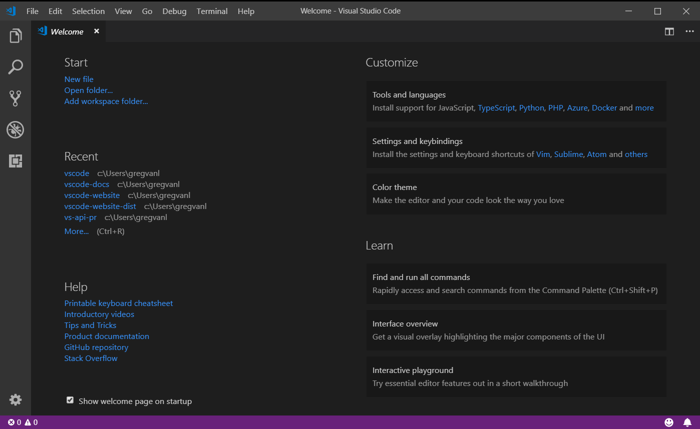

# [VS Code Tips and Tricks](https://code.visualstudio.com/docs/getstarted/tips-and-tricks)

> 帮你进入状态并了解如何高效的使用VS Code。你会非常熟悉它的强大的编辑，代码智能，和源码控制特性并学会有用的键盘快捷键。本节内容比较宽泛浅显，请在[开始](https://code.visualstudio.com/docs/getstarted/userinterface)和[用户引导](https://code.visualstudio.com/docs/editor/codebasics)中阅读其他更深入章节。

## 基础

**开始**

打开**Welcome**页从基础开始使用  VS Code。*Help > Welcome*

在**Welcome**页面的右下角，有一个**Interactive playground[^1]**，你可以交互式的尝试 VS Code的特性。*Help ＞ Interactive Playground*

**命令调色板[^2]**

在你的当前上下文中访问所有可用命令

快捷键：`ctrl + shift +p`

**快捷键参考表**

- [Windows](keyboard-shortcuts-windows.pdf)
- [Linux](keyboard-shortcuts-linux.pdf)
- [macOS](keyboard-shortcuts-macos.pdf)

**快速打开文件**

快捷键：`ctrl + p`

[^1]:交互广场
[^2]: command palette

